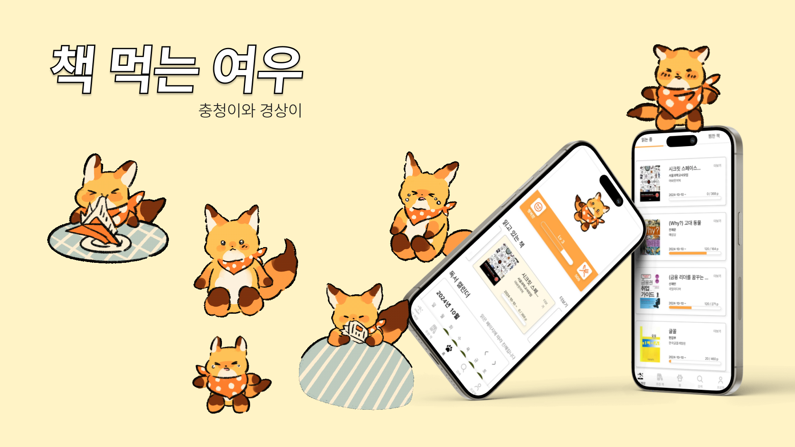
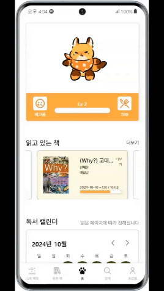
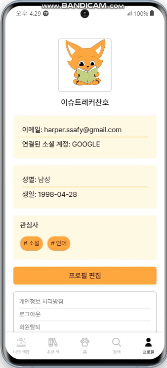
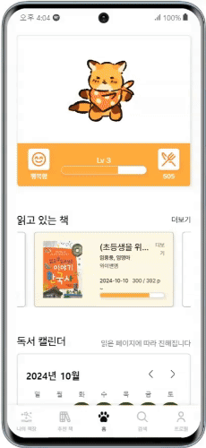
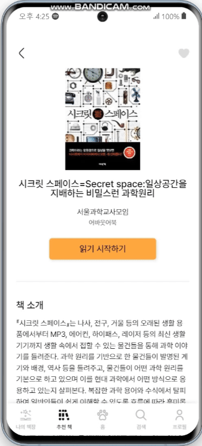
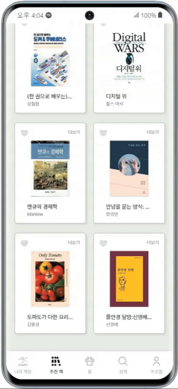
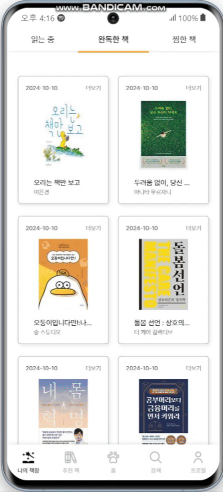

# 책 먹는 여우🦊📚

# :one: 프로젝트 개요

## 1. 개발 기간

| 개발기간 | 24.09. ~ 24.10.11 |
| --- | --- |

## 2. 구성 팀

| 팀원 | 역할 | 세부 내용 | 
| --- | --- | --- |
| 백하람 | Infra, Back-End Developer | FE |

## 3. 기획 의도 및 목표

:star: 목표
| No | Content | 세부 내용 | 
| --- | -------------------- | ----- |

   
   

# :two: 서비스 기능 소개

## 1. 홈 화면 & 마이페이지
- 홈 화면 
  : 내가 읽은 책 통계 및 내 여우 상태

  

- 마이페이지
  : 내 정보

  

## 2. 추천
- 관심사 및 나이/성별에 따른 도서 추천

  

- 특정 책에 평점을 매긴 독자들이 선호하는 책 추천

  

## 3. 내 책자
- 읽는 중/완독/찜한 도서 관리

  

- 리뷰/독후감/메모

  
